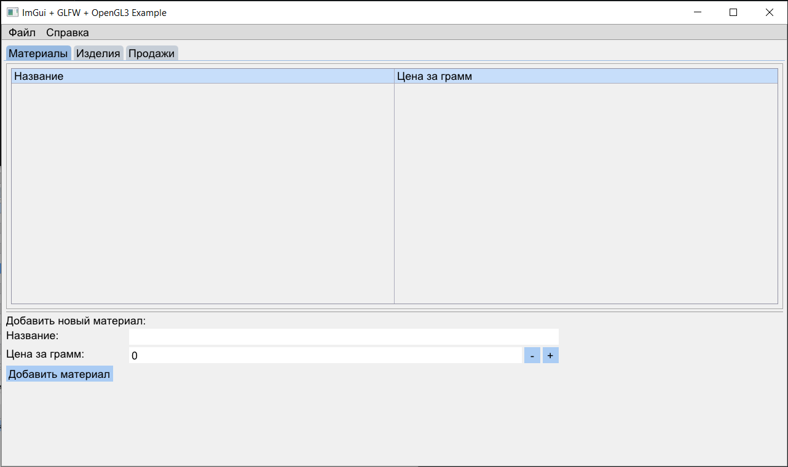
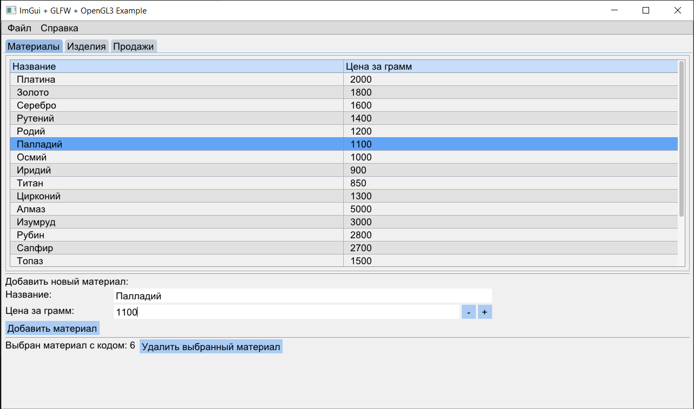

# Jewelry Database Management System

Графическая система управления базой данных ювелирных изделий, разработанная на C++ с использованием ImGui и GLFW.

---

# О проекте

Данный проект представляет собой desktop-приложение для работы с базой данных ювелирных изделий. Основной задачей программы является предоставление удобного графического интерфейса для хранения, просмотра и редактирования информации о материалах, изделиях и продажах.

Интерфейс приложения реализован с использованием библиотеки Dear ImGui, обеспечивающей быстрое создание современных GUI-приложений на C++, а библиотека GLFW используется для создания окна программы, обработки событий и взаимодействия с OpenGL.

Программа ориентирована на упрощение работы с ювелирной базой данных и предоставляет пользователю интуитивно понятный интерфейс для управления различными сущностями системы.

---

# Возможности

Система поддерживает работу с материалами, из которых изготавливаются ювелирные изделия. Для каждого материала хранится информация о его названии и стоимости за грамм. Это позволяет рассчитывать стоимость изделий и организовывать хранение данных о различных типах металлов, таких как золото, серебро или платина.

Также программа предоставляет возможность управления изделиями. Пользователь может добавлять новые изделия, редактировать существующие записи и просматривать информацию о каждом объекте. Для изделия сохраняются его характеристики, включая тип, вес, материал и стоимость.

Отдельная часть системы посвящена учёту продаж. Приложение позволяет хранить информацию о реализованных изделиях, включая дату продажи и данные покупателя. Таким образом обеспечивается связь между изделием и фактом его продажи.

---

# Интерфейс приложения

Приложение использует графический интерфейс, построенный на базе Dear ImGui. Интерфейс содержит таблицы данных, формы редактирования и элементы навигации между различными разделами системы.

Благодаря использованию ImGui программа обладает высокой скоростью работы и удобным взаимодействием с пользователем. GLFW обеспечивает создание окна приложения и обработку пользовательских событий, а OpenGL используется для рендеринга интерфейса.

---

# Используемые технологии

В процессе разработки проекта использовались следующие технологии: Dear ImGui, GLFW, OpenGL, SQLite, JSON.

---

# Скриншоты

## Главное окно

---

## Таблица материалов с загруженной БД

---

# Планы по развитию

* [ ] Экспорт данных в Excel
* [ ] Система поиска и фильтрации
* [ ] Поддержка изображений изделий
